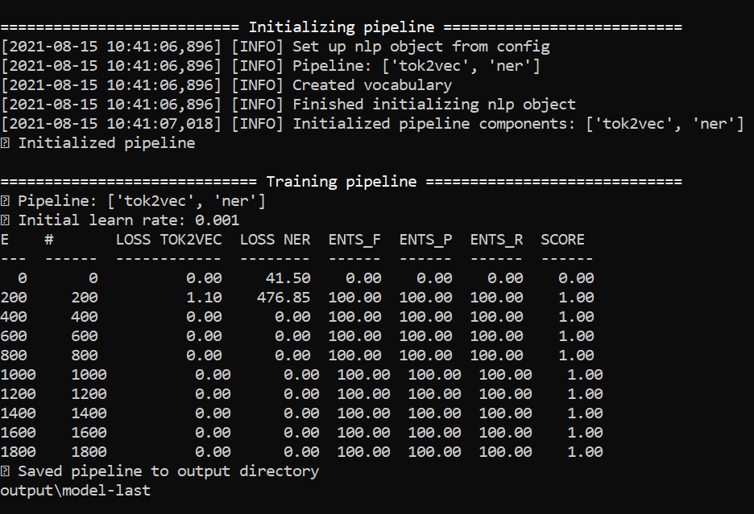

## NER分词模型训练流程

## 建筑文本-json训练格式转换官网

https://tecoholic.github.io/ner-annotator/

## Creating the Config file for training the model

https://spacy.io/usage/training#config

```bash
# 进入页面的 "Quickstart"部分，选择你的配置。(确保选中 NER，可以根据自己的要求选择语言
```


# 设置完成后，下载config file。


# 转到存放 base_config.cfg 的目录，然后运行以下命令
python -m spacy init fill-config base_config.cfg config.cfg


# Run the Training configuration
python -m spacy train config.cfg --output ./output --paths.train ./train.spacy --paths.dev ./train.spacy 



# 调用模型

nlp1 = spacy.load(r".\output\model-best") #load the best model
doc = nlp1("建筑相关问题") # input sample text

spacy.displacy.render(doc, style="ent", jupyter=True) # display in Jupyter

